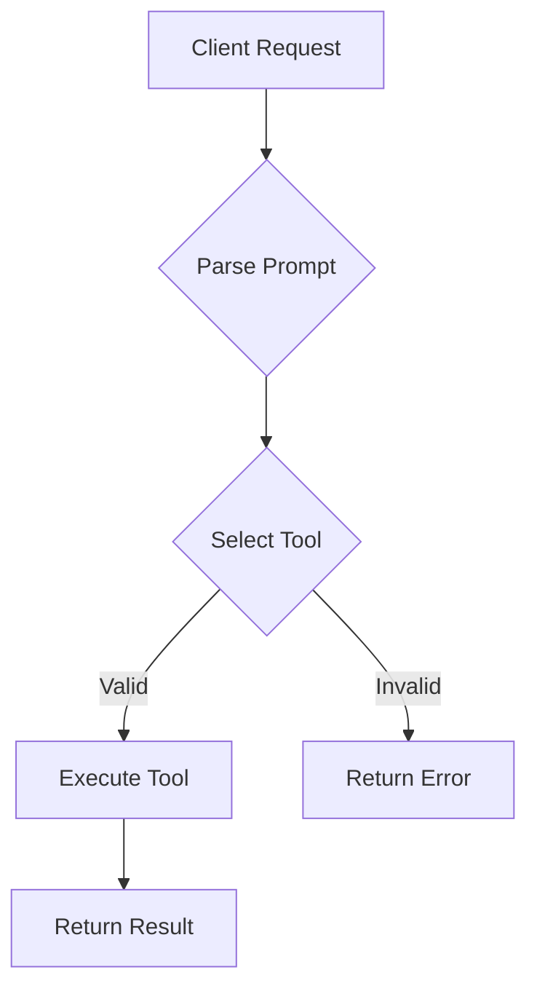

# Execute API

This document describes the `/api/execute` endpoint implemented in
`services/api/server.js`. The root `server.js` file does not provide this
route; it is part of the main API server under the `services/api` directory.
For details on how ReACT prompts are parsed, see
[`parseReactPrompt.md`](./parseReactPrompt.md).

## Inputs
- `prompt` – full text prompt in ReACT format.
- `toolId` – optional explicit tool identifier.

## Outputs
- `success` – boolean result flag.
- `output` – tool output text or error message.

## Example

```bash
curl -X POST http://localhost:3333/api/execute \
  -H "Content-Type: application/json" \
  -d '{"prompt":"Thought: say hello\nAction: echo"}'
```

## Flow
1. Parse the prompt using the ReACT format.
2. Determine the tool via `toolId` or `Action:` line.
3. Run the matching tool function.
4. Return the output as JSON.



## Known Issues
- Only two example tools are provided (`echo` and `reverse`).
- Streaming responses are not yet supported.
