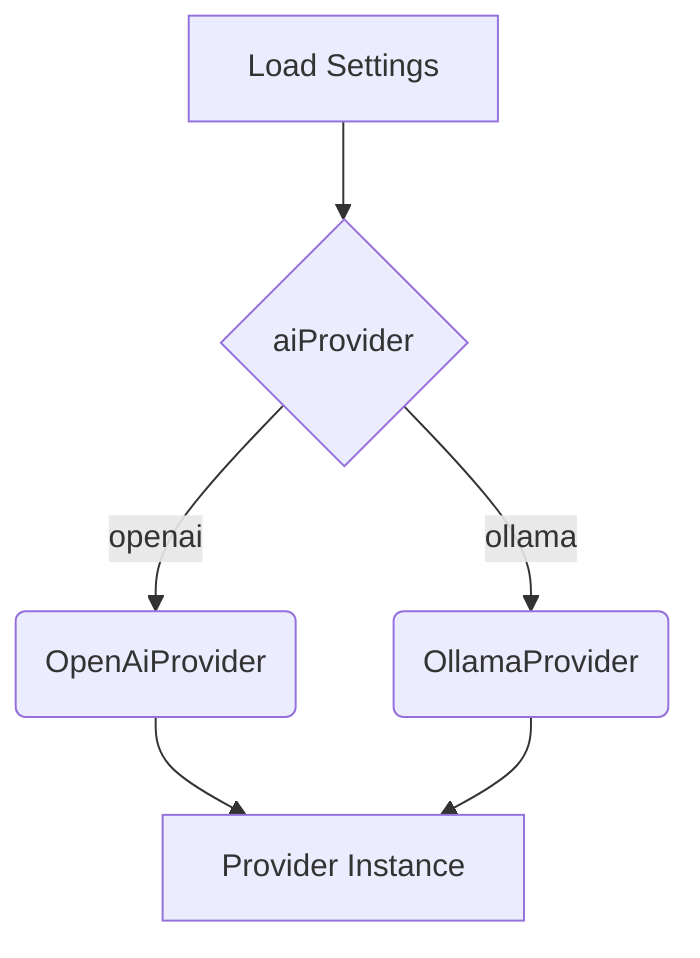

# Pluggable AI Provider

This document describes the strategy used to select between multiple AI providers.

## Inputs
- User settings specifying `aiProvider`, `openaiApiKey`, and `ollamaUrl`.

## Process
1. `createAiProvider()` reads settings via Pinia.
2. Depending on the provider name it constructs `OpenAiProvider` or `OllamaProvider`.
3. Each provider conforms to the `IAiProvider` interface defined in `apps/renderer/types/ai-provider.d.ts`.

## Outputs
- An object exposing `getAvailableModels()` and `getCompletion()`.

Known issues: network failures should be handled in the calling code.
